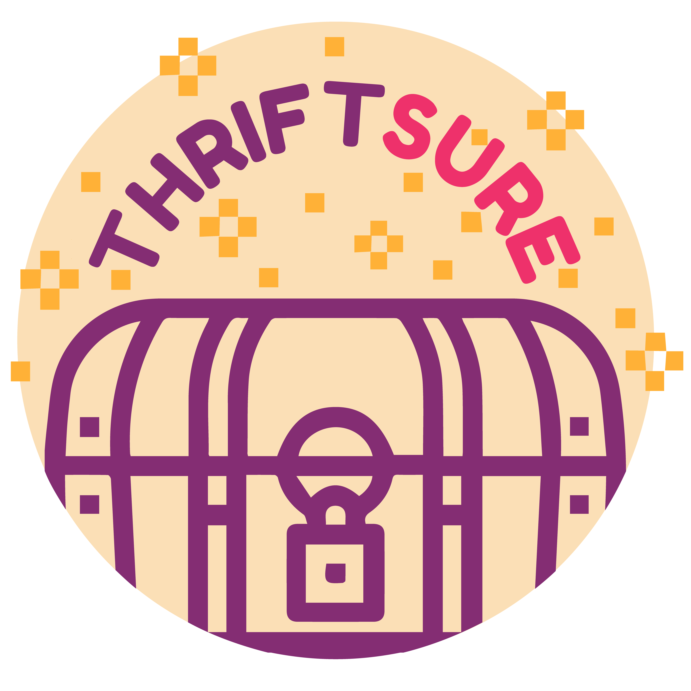
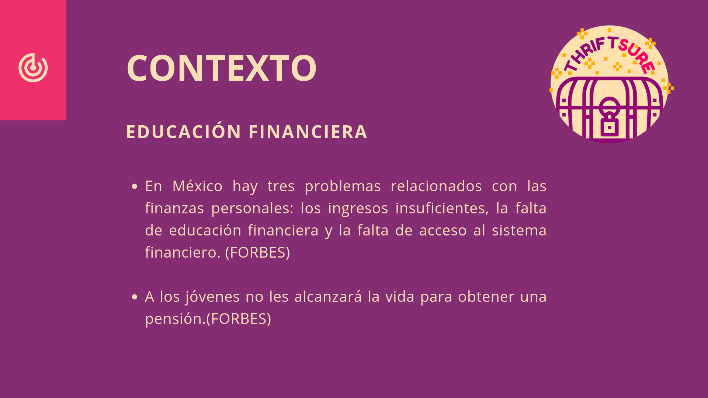
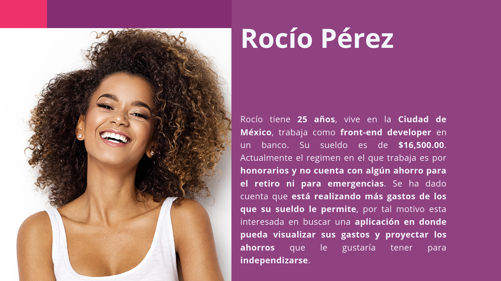

# THRIFTSURE

## RESEARCH

En la etapa de investigación se realizó una [encuesta](https://docs.google.com/forms/d/e/1FAIpQLSfS0lXYoexZ70SVpinzMgoBVH-CAVXzXkmNaE7N3wdJZhWcyg/viewform), donde se plantearon preguntas para definir a nuestra usuaria, conocer sus necesidades y, posteriormente, definir de qué manera podríamos solucionar esas necesidades con nuestro producto.

Los datos que obtuvimos fueron de 35 encuestadas y fueron los siguientes:

- El 85.7% tienen entre 21 y 39 años.
- A la hora de elegir una oferta de trabajo el 80% consideró que cubriera sus necesidades económicas.
- Descubrimos que 40% planifica sus gastos de manera semanal, 25.7%, no planifica, el 19.4% de manera mensual y  el 17.1% lo hace manera quincenal.
-El 45.7% de nuestras potenciales usuarias tratan de ahorrar pero en ocasiones sus gastos no se lo permiten, el 40% respondió que tiene intenciones de ahorrar pero no lo han llevado a cabo.
- El 51.4% ahorra para tener un respaldo para las emergencias, seguido de un 28.6% que ahorra para poder independizarse.
- Es relevante mencionar que 42.9% establece un límite de gastos mes con mes para evitar compras innecesarias.
- Finalmente el 91.4% está interesado en una aplicación que le permita visualizar sus ingresos, egresos y futuros ahorros.

Ademas de la información anterior, decidimos realizar una breve búsqueda sobre el contexto actual con respecto a la educación financiera y ahorro para el retiro, encontrando lo siguiente:

A partir de los datos obtenidos por la encuesta y de la breve investigación del contexto, concluimos que nuestra UserPersona es:

Una vez que definimos nuestra user persona, realizamos un [prototipo](https://marvelapp.com/c155ec1/screen/59606621) de baja fidelidad con el fin de poder testearlo con nuestras posibles usuarias. 

Y una vez testeado el prototipo de baja fidelidad se realizó un prototipo de alta fidelidad para que nuestra usuaria pudiera 